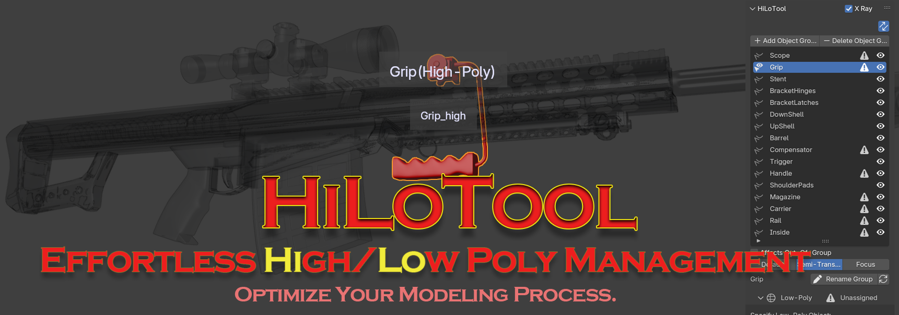
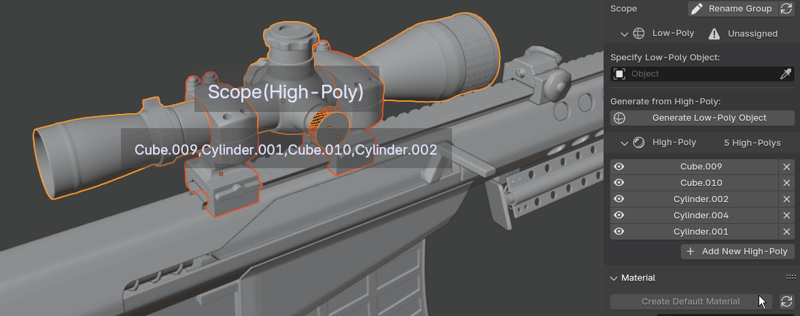
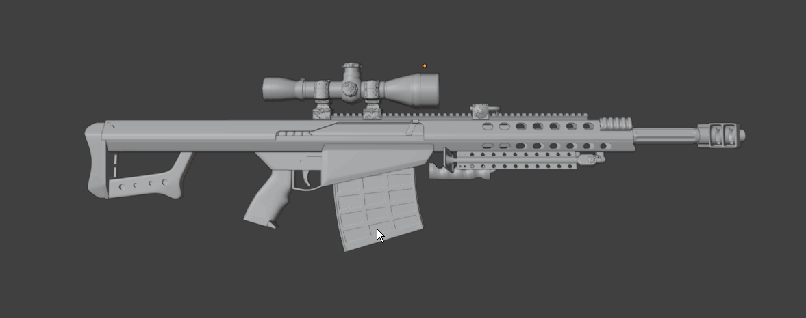
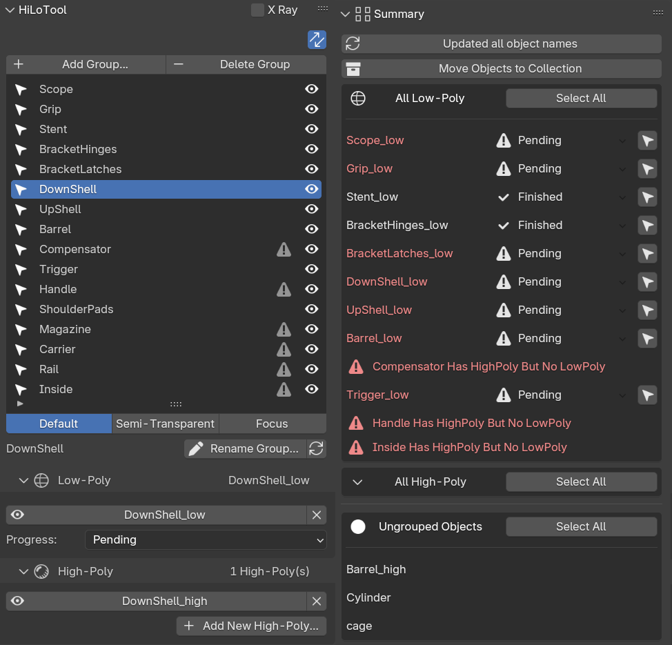

HiLoTools is a powerful Blender add-on designed to streamline the management of high-poly and low-poly models.This tool provides an array of features to simplify your workflow and boost efficiency.

[中文版本 (Chinese)](README_zh.md)

>This add-on is built using the Blender Addon Package Tool, a high-quality development framework that accelerates Blender plugin creation.

<!-- TOC -->
  * [Features](#features)
    * [**👓 Stay Informed**](#-stay-informed)
    * [**🚀 Quick Start**](#-quick-start)
    * [**🖱 Hover Selection**](#-hover-selection)
    * [**🔍 Focus Mode**](#-focus-mode)
    * [**♻️ Seamless Group Switching**](#-seamless-group-switching)
    * [**📷 X-Ray View**](#-x-ray-view)
    * [**🧠 Smart Editing**](#-smart-editing)
    * [And much more!](#and-much-more)
* [Contribution](#contribution)
<!-- TOC -->

## Features

### **👓 Stay Informed**
Always stay aware of your selections. HiLoTools highlights and informs you about the currently selected objects, so you know exactly what you're working with.

### **🚀 Quick Start**
Kickstart your low-poly modeling process with ease. HiLoTools lets you clean up modifiers and generate a simple low-poly base model to get started.

### **🖱 Hover Selection**
Hold `Ctrl + Alt` at any time to instantly select the group under your mouse cursor.

### **🔍 Focus Mode**
Eliminate distractions with a semi-transparent mode that fades out irrelevant content, allowing you to fully focus on your current task.

### **♻️ Seamless Group Switching**
Easily switch between high-poly and low-poly models (or vice versa) in **any mode** using `Ctrl + Mouse Wheel`.

### **📷 X-Ray View**
Enable `X-Ray mode` for an intuitive overlay of your models, making it easier to evaluate shape differences in real-time.

### **🧠 Smart Editing**
When you select both high-poly and low-poly models and enter Edit Mode, HiLoTools automatically switches to the low-poly model for editing, saving you the hassle of manually selecting the correct object.

Additional Features:
- **Batch Renaming**: Tired of messy object names like `Cube.003` or `Sphere.010`? Rename all objects with a single click.
- **Object Summarization**: Quickly select all objects of a specific type with ease.
- **Enhanced Local View**: Seamlessly add or remove objects from your local view without leaving it.
- **Progress Tracking**: Get a complete overview of your progress to ensure no low-poly models are overlooked.

### And much more!

# Contribution
We warmly welcome contributions to HiLoTools! If you have ideas for new features or have fixed a bug, feel free to share them with us by submitting a pull request.
