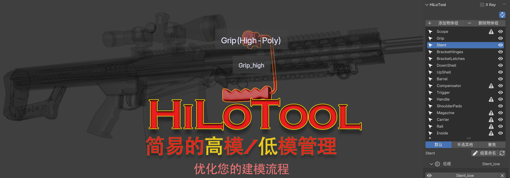
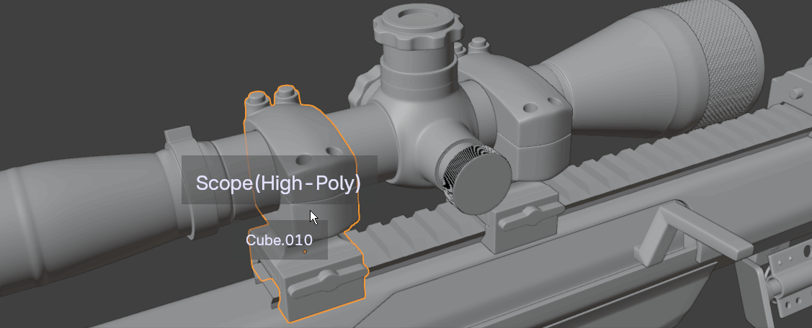
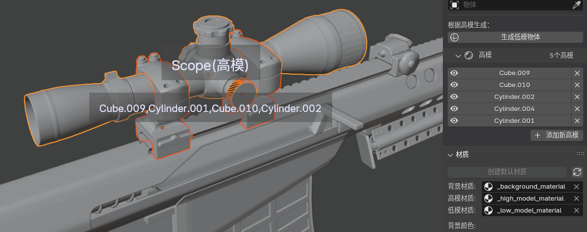
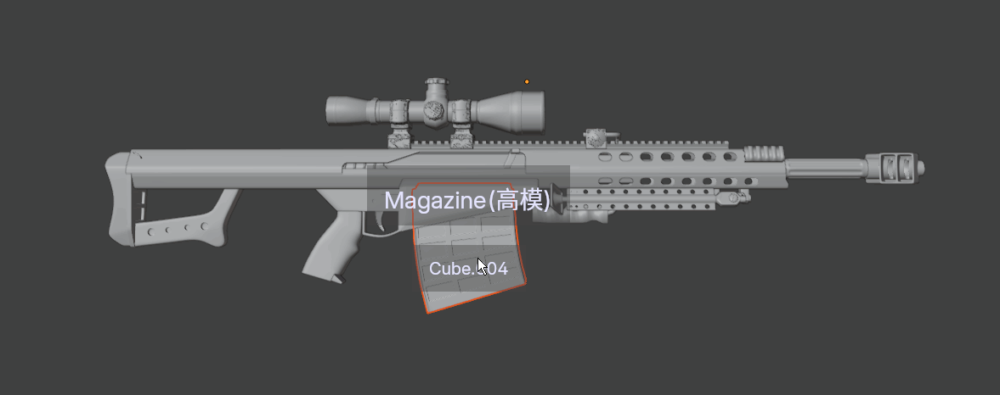
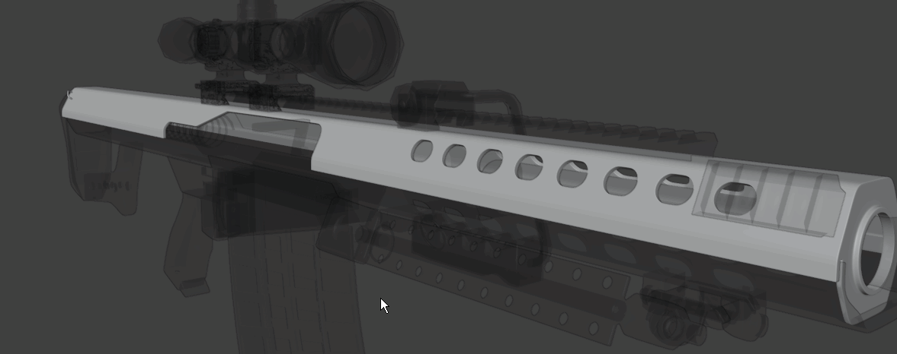
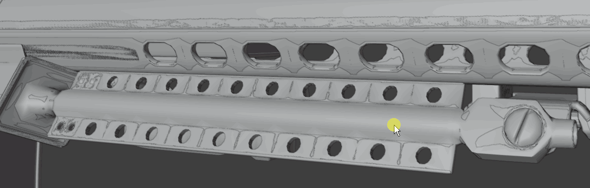
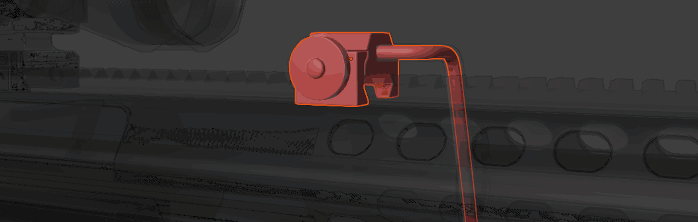
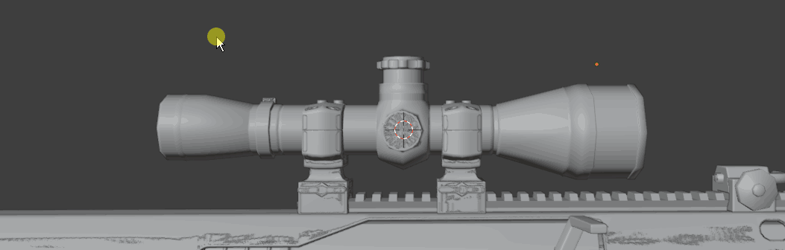
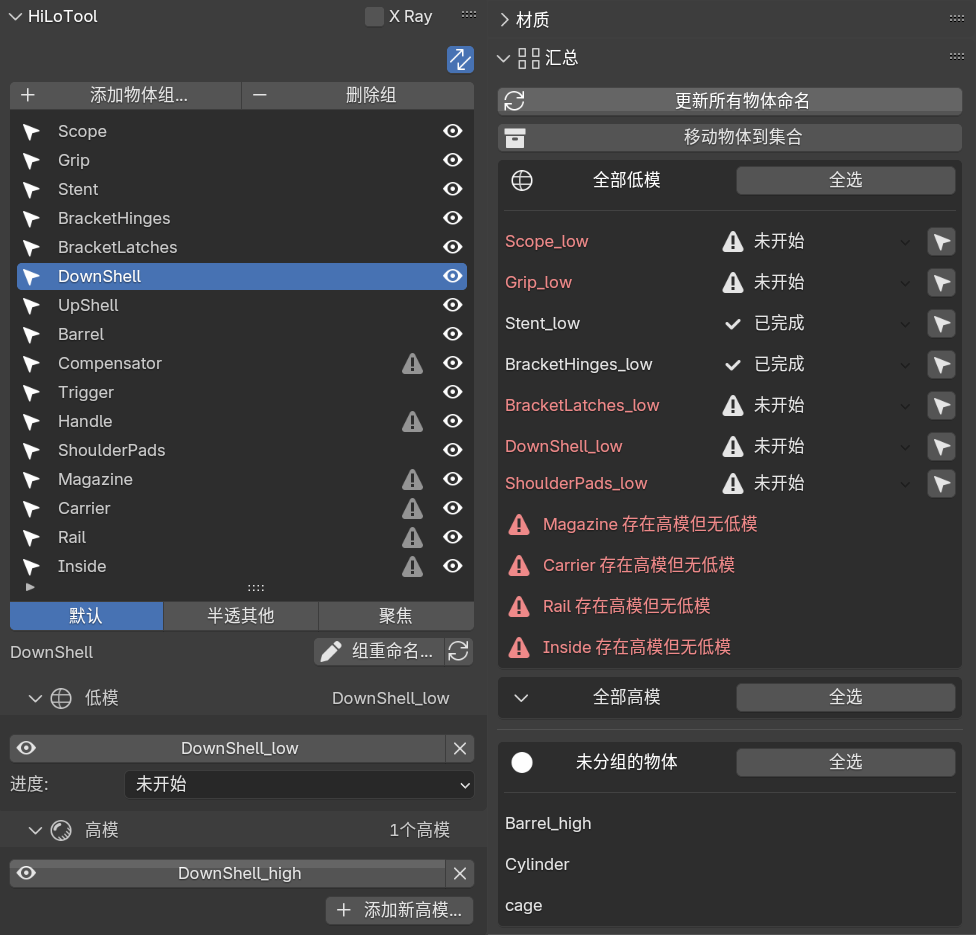

HiLoTools 是一款Blender插件，旨在帮助艺术家更高效地管理高低模型。它提供了一系列强大的功能，使得高低模型的管理变得简单。

[English (英文版本)](README.md)

>此插件基于Blender Addon套件进行开发,一个高质量,加速开发的框架

<!-- TOC -->
  * [特性](#特性)
    * [**👓目标提示**](#目标提示)
    * [**🚀快速开始**](#快速开始)
    * [**🖱悬浮选择**](#悬浮选择)
    * [**🔍摒除干扰**](#摒除干扰)
    * [**♻️组内快速切换**](#组内快速切换)
    * [**📷X-Ray透视**](#x-ray透视)
    * [**🧠智能编辑**](#智能编辑)
    * [以及更多！](#以及更多)
  * [贡献](#贡献)
<!-- TOC -->

## 特性

### **👓目标提示**
插件将在您选择网格物体时,提醒您当前的所选物体.

### **🚀快速开始**
插件可以帮助您清除修改器,生成一个简易低模作为开始

### **🖱悬浮选择**
在任何时候按住`Ctrl Alt`,即可自动选择`🖱鼠标`当前悬停的组

### **🔍摒除干扰**
在半透模式下,淡化不相关的内容,聚焦于您当前工作

### **♻️组内快速切换**
允许您在**任何模式**,使用`Ctrl+🖱滚轮`从低模切换到高模,或从高模切换到低模

### **📷X-Ray透视**
随时开启X光模式,对当前组进行透视,更直观的评估形状差异

### **🧠智能编辑**
当您同时选择了高模与低模进入编辑模式时,插件自动切换到低模进行编辑,使您无需花费时间寻找低模物体

- **分组命名**: 尽管保留`Cube.003`、`Sphere.010`...现在只需一个按钮即可对所有物体自动命名
- **物体汇总**: 能够快速选择指定类型的所有模型
- **局部视图**: 随时切换到局部视图,在不退出局部视图前提下向视图中添加或减去物体
- **进度管理**: 进度总览,防止您忘记某个低模

### 以及更多！

## 贡献

欢迎为HiLoTools做出贡献！如果你有好的功能建议或修复了一个bug，请通过提交pull request与我分享。

